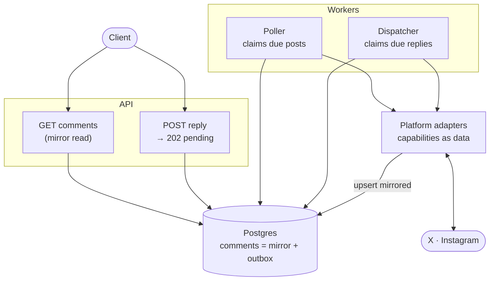

# Blotato — Multi-Platform Comment System

Read comments on published posts and reply to them, across social platforms,
behind one REST API.

NestJS · TypeScript · Postgres 16 (TypeORM, hand-written migrations)

---

## How it works

Comments live in **our** database, not on the platform. Reads hit Postgres.
A poller keeps the mirror fresh. Replies are written locally first and
delivered out of band by a dispatcher.



Everything else in this document follows from that shape:

| | How it behaves |
|---|---|
| **Read path** | Client → Postgres. One indexed query, no platform call. |
| **Write path** | Client → `pending` row → `202`. The dispatcher delivers, retries and records. |
| **Platform layer** | Adapters behind one interface; differences expressed as **capability data**, never as `if (platform === …)`. |

---

## Contents

- [Run it](#run-it)
- [Why a mirror](#why-a-mirror)
- [Why an outbox](#why-an-outbox)
- [Platforms](#platforms)
- [API](#api)
- [Data model](#data-model)
- [Assumptions](#assumptions)
- [Not built](#not-built)
- [Tests](#tests)
- [AI usage](#ai-usage)

---

## Run it

```bash
npm install
docker compose up -d          # Postgres on :55432
cp .env.example .env
npm run migration:run
npm run demo                  # boots the API with a seeded thread
```

`npm run demo` prints ready-to-paste `curl` commands. Swagger is at `/docs`.

```bash
npm test        # 25 unit tests, no database needed
npm run typecheck
```

The demo runs against a `fake` adapter implementing the same interface as the
real ones, so sync, threading, pagination, the outbox and its dispatcher are all
exercisable without credentials. It is opt-in (`ENABLE_FAKE_PLATFORM`, set by the
demo itself) and never registered under `NODE_ENV=production`.

---

## Why a mirror

`GET /v1/posts/:id/comments` reads Postgres. Proxying to the platform looks
simpler and breaks quickly:

- **Rate limits are per connected account, and publishing needs that budget.**
  Refreshing a busy post should not cost a scheduled post.
- **Every platform paginates differently** — X opaque tokens, Instagram Graph
  cursors, LinkedIn offsets. One API cursor across all of them is impossible if
  the cursor has to be theirs.
- **Reads would inherit platform latency and downtime.**
- **Cross-post questions become answerable.** "Every unanswered comment across
  all my posts" is `GET /v1/comments?unansweredOnly=true` — it spans posts and
  platforms, so no upstream API could serve it at any number of requests.

The cost is staleness, so staleness is reported rather than hidden:

```json
"meta": { "syncedAt": "2026-08-11T13:37:07Z", "stale": false }
```

`?refresh=true` forces a live pull first. If that pull fails the request still
returns cached comments with `meta.syncError` set — a slightly stale answer beats
a 502, as long as the caller is told.

**Polling is adaptive.** Comment activity decays with post age, so the interval
scales with it (1 min under an hour old → 6 h after a week), ×10 where webhooks
exist and polling is only a reconciliation net. Cost tracks *active* posts, not
every post ever published.

---

## Why an outbox

`POST /v1/comments/:id/replies` writes a row with `delivery_status = 'pending'`
and returns **202**. A dispatcher delivers it.

Calling the platform inline turns a 30-second timeout into a 30-second HTTP
request, makes a 429 the user's problem to retry by hand, and — worst — turns a
network failure *after* the platform accepted the write into a duplicate public
comment.

The reply row **is** the queue entry and **is** the comment, so:

- one INSERT both accepts and enqueues; a reply cannot be accepted but unqueued,
- it appears in its thread instantly, in the right position,
- `Idempotency-Key` is enforced by a unique index, so a retried POST returns the
  original reply instead of posting twice.

Workers claim with `FOR UPDATE SKIP LOCKED`, which scales horizontally with no
broker and no lock service. Claiming also pushes the next-attempt time forward as
a visibility timeout, so a worker that dies mid-delivery releases its rows instead
of stranding them. The poller claims the same way, for the same reason.

Retries use exponential backoff **with full jitter**: an outage fails every
pending reply at once, and without jitter they would all retry in the same
instant. Failures that need a human rather than time — revoked token, rejected
body, or a write the platform accepted without returning an id — fail immediately
instead of burning the attempt budget.

---

## Platforms

An adapter implements two methods and declares its capabilities as **data**:

```ts
interface PlatformCapabilities {
  maxThreadDepth: number | null;  // 1 = flat (Instagram); null = unbounded (X)
  maxBodyLength: number;
  supportsWebhooks: boolean;      // false → poll
  mentionOnReparent: boolean;
}
```

Domain code branches on capabilities, never on `platform === 'instagram'`.
**Adding a platform is one class plus one entry in the `CLIENTS` array** — no
service, controller, entity or migration changes. `platform` is stored as `text`
and typed as `string`, so onboarding one never requires a migration.

Two things this bought:

**Depth clamping.** Instagram flattens a reply-to-a-reply. Storing the requested
parent would leave our mirror disagreeing with the platform on the next sync, so
the reply is re-parented to the deepest allowed ancestor, `@mentions` the person
actually being answered, and the response says `wasReparented: true`. The length
check runs *after* the mention is prepended, since it counts against the limit
and discovering that at delivery time is a failure the user cannot fix.

**Capability discovery.** `GET /v1/platforms` serves the same objects the backend
enforces, so clients render correct counters and nesting rules instead of
shipping their own copy of the platform matrix and drifting from it.

---

## API

| Method | Path | Notes |
|---|---|---|
| `GET` | `/v1/posts/:postId/comments` | Thread view: top-level comments. Owns `?refresh` |
| `POST` | `/v1/posts/:postId/comments` | Comment on your own post → `202` |
| `GET` | `/v1/comments` | Search across posts: `?postId` `?parentCommentId` `?platform` `?since` `?until` `?unansweredOnly` |
| `GET` | `/v1/comments/:id` | One comment; the poll target for a queued reply |
| `GET` | `/v1/comments/:id/replies` | Direct replies |
| `GET` | `/v1/comments/:id/thread` | Whole subtree, any depth, in reading order |
| `POST` | `/v1/comments/:id/replies` | Reply → `202` (`200` on idempotent replay) |
| `GET` | `/v1/platforms` | Supported platforms + capabilities |

Every comment listing takes `?limit` `?cursor` `?order`.

| Rule | Why |
|---|---|
| Nested route **and** flat collection | Thread view vs. cross-cutting view. `?refresh` lives only on the nested one, where a single post bounds the sync a request can trigger. |
| Replies never inlined in a listing | One 400-reply thread would dwarf a 400-comment page. `replyCount` tells clients where to page. |
| Keyset pagination, never `OFFSET` | Lists are append-heavy and shift under the reader. |
| Cursors are ours, not the platform's | Opaque base64 over `(sortKey, id)`, so a platform changing its pagination can't invalidate cursors clients hold. |
| RFC 9457 `problem+json` | Stable `code` to branch on, separate from the HTTP status. |
| Platform failure → `502`/`504`, never `500` | The caller's request was fine; keeps 5xx alerting meaningful. |

---

## Data model

`social_accounts` → `posts` → `comments` → `comment_authors`, plus
`comment_sync_state`. Full DDL in [`src/database/migrations`](src/database/migrations).

| Choice | Why |
|---|---|
| One `comments` table for mirrored comments **and** outbound replies, split by `origin` | A pending reply must appear in its thread instantly; a separate outbox would make every read union two sources and re-derive ordering. Check constraints keep both shapes honest. |
| `parent_id` + `root_id` + `depth` + materialised `path` | `ORDER BY path` returns a conversation already assembled and `path LIKE 'x/%'` is one range scan — no recursive CTE per read. |
| Path segment = zero-padded `<epoch ms>-<short id>` | Makes lexicographic order *identical* to chronological reading order. |
| `sort_at` generated from `COALESCE(platform_created_at, created_at)` | One sort key everywhere, so a pending reply orders correctly and doesn't jump once delivery fills in the real timestamp. |
| Partial unique `(social_account_id, platform_comment_id)` | Re-polling a thread head is a no-op, not a duplicate. Threading columns are never updated on conflict: rewriting a `path` invalidates every descendant's. |
| Soft deletes | Comments vanish upstream constantly; hard deletes orphan replies and erase a conversation the customer may have acted on. |
| Partial indexes | The outbox index stays proportional to the queue, not to all comment history. |

A closure table would also work, but costs O(depth) rows per insert and syncing
is write-heavy.

---

## Assumptions

Left unspecified by the brief; each sits behind a seam.

| Assumption | What that means here |
|---|---|
| **Auth exists** | `X-Workspace-Id` stands in for it. Only the *source* of the id is stubbed: every service method takes `workspaceId` and every query filters on it. Another workspace's post returns `404`, not `403` — `403` would confirm the id exists. |
| **OAuth storage exists** | `TokenVault` is the abstraction. Rows hold a `credential_ref`, never a token, fetched per call so a refresh lands on the next attempt. |
| **Posts and accounts exist** | Modelled only as deep as comments need. |
| **Published posts only** | No thread exists before publication. Check constraint + `409`. |
| **Platform counters are authoritative** | `likeCount`/`replyCount` may exceed what we mirrored; clients use them to know more exists. |
| **Own posts only** | Monitoring third-party posts is a different product with different permissions. |
| **Platform retention bounds first capture** | X reads a 7-day search window, so older replies can't be mirrored by any amount of paging. Once mirrored, a comment is ours and stays. |

---

## Not built

Called out rather than half-built.

| Gap | Where it stands |
|---|---|
| **Per-account rate-limit budgeting** | The most load-bearing gap: the mirror is justified by protecting this budget. Adaptive polling and `Retry-After` are half; a token bucket shared by sync and publish is the rest. |
| **Webhook receivers** | The capability flag, the polling fallback and the method a receiver would call (`CommentSyncService.ingest`) all exist. Missing: per-platform signature verification. |
| **Multi-tenant fairness** | Both workers claim in global due-time order, so one large workspace can starve others. |
| **Bounded dispatch concurrency** | Delivery is sequential per batch, and no ordering is guaranteed between two replies to one thread. |
| **Per-account capabilities** | Static per adapter, while real platforms vary by API tier and scope. The capability model's ceiling. |
| **Delete/hide, a broker, reply audit** | Not in the brief. Postgres-as-queue is correct at this scale; the swap sits behind one class. |

---

## Tests

**25 unit tests**, no database required: depth clamping and mention rewriting,
idempotent replay vs. conflict, per-platform limits, retryable vs. terminal
delivery failures, sync threading and re-sync id/path preservation, path
ordering, cursor round-trips.

The real risk here is SQL and concurrency, which stubs can't reach, so the rest
was verified against a real Postgres 16: migrations applied, the full flow driven
over HTTP (sync → list → paginate → reply → re-parent → replay → delivery →
re-sync without duplication), claim queries checked for double-claiming, query
plans read at 50k rows.

Bugs that surfaced **only** there:

- `UPDATE … RETURNING` returns `[rows, affectedCount]` in TypeORM
- the migration CLI never loaded `.env`, so it silently used the default database
- the cross-post query had no supporting index — sequential scan plus sort
- the poller's "claim" was a plain `SELECT`, letting every worker poll every post

CI running that flow against a Postgres service container is the obvious next
step, and is not here.

---

## AI usage

I used Claude (Claude Code) throughout, the way I'd use a fast pair: I made the
architectural calls — mirror-vs-proxy, outbox-vs-inline, capability-driven
adapters, the threading representation — and used it to draft implementations
against them, then reviewed and cut hard.

Two passes were specifically about *removing* AI output: one dropped a third
adapter, a `DELETE` endpoint, a redundant sync route and unused columns; the
other reduced code comments to single lines, moving the reasoning here instead.

I verified everything I kept. It typechecks, the tests pass, the migrations run
on real Postgres, and the flow above was driven over HTTP — the bugs listed under
Tests were found that way rather than taken on faith.
